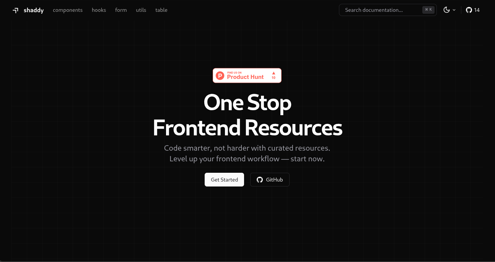

# shaddy

Shaddy is built on top of Next.js and shadcn/ui using TypeScript. Our goal is to share reusable code and make Shaddy a one-stop frontend solution. We are creating reusable components, hooks, utilities, forms, and tables, and will expand to a wide range of frontend engineering topics.

## Documentation

Visit https://shaddy-docs.vercel.app to view the documentation.

## Contributing

Please read the [contributing guide](./CONTRIBUTING.md).

## License

Licensed under the [MIT license](./LICENSE.md).
