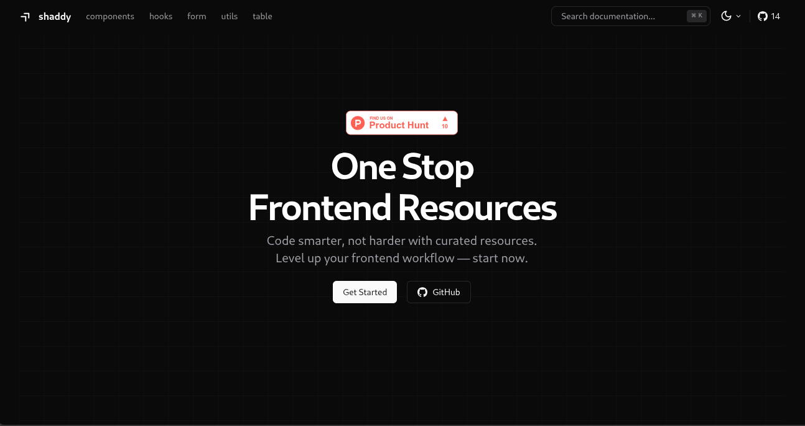

# shaddy

Shaddy is built on top of Next.js and shadcn/ui using TypeScript. Our goal is to share reusable code and make Shaddy a one-stop frontend solution. We are creating reusable components, hooks, utilities, forms, and tables, and will expand to a wide range of frontend engineering topics.

## Documentation

Visit https://shaddy-docs.vercel.app to view the documentation.

## MCP Server

Shaddy provides a **public MCP (Model Context Protocol) server** that allows developers and AI agents worldwide to explore the Shaddy component library.

**Live Endpoint:** `https://shaddy-docs.vercel.app/api/mcp`

The MCP server exposes:
- 📦 Complete component and hook registry
- 📂 Project file structure
- 🔍 Code search across the codebase
- 📖 Source code reading
- 🌐 Publicly accessible via HTTP

Perfect for:
- AI assistants (Claude, ChatGPT, etc.)
- Developer tools and IDEs
- Custom integrations
- Documentation and discovery

For detailed usage instructions, see [MCP_SETUP.md](./MCP_SETUP.md).

## Contributing

Please read the [contributing guide](./CONTRIBUTING.md).

## License

Licensed under the [MIT license](./LICENSE.md).
